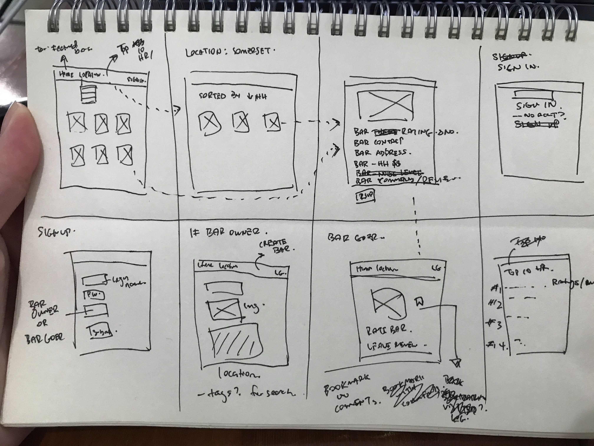
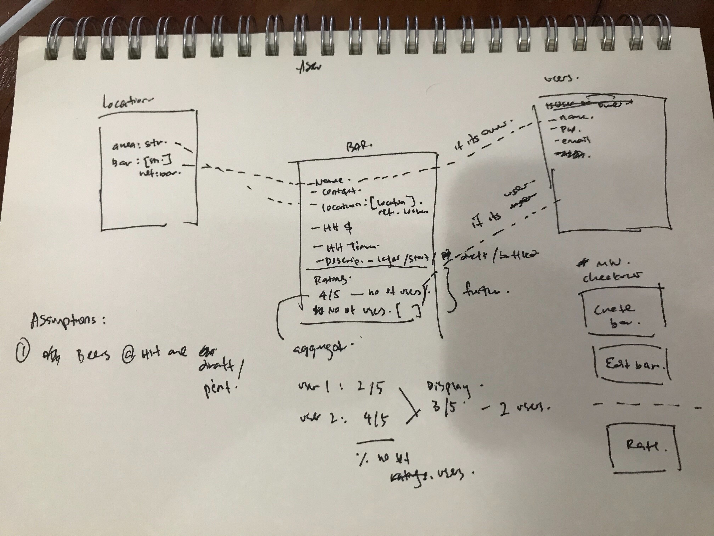

# SEI-23 Project 2

## BrewTime
Access here: https://brewtime.herokuapp.com/

### Motivation

### Technologies
1. Node.js
2. Express.js
3. EJS
4. MongoDB, mongoose
5. Passport
6. Multer
7. Cloudinary
8. Heroku

### Models
1. User
2. Bar
3. Location

#### User Stories
- As a bar owner, I want to add/edit my bar listing and details in the app to attract bar goers who visit the app

- As a bar goer, I want to know the listing of available bars based on location, details especially HH PRICE, TIME and ratings

- As a bar goer, I would like to rate the bars to keep others informed

### Wireframe

#### Actual

### MVP 
#### Features
- List bars in a search location
- Within each bar, display the following details
    - Location
    - Address
    - Contact
    - HH Price
    - HH Time
    - NH Price
    - Opening Hours
    - Brew Types
    - Ratings

- Users 
    - Admin
    - bar owners
    - ordinary user

- Sign-in
    - admin
        - ability to create/add new locations for bar owners to select from
        - view all the bar owners (& their bars) and regular users
        - update featured list
    - bar owners 
        - view all their bar listings
        - ability to create bar and add to specific location listing, upload bar image
        - edit bar details & ability to replace image
    - reg sign-in users
        - ability to rate bars

- Without Sign-in
    - All
        - can view home page, all locations, all bars in a specific location, specific bar info
        - can search on navbar or do advanced search on home page based on location, brew types, prices

### Further
#### Features
1. Sort listing function based on price
2. Filter listing based on HH start time

3. Rating
- Sign-in
    - Ordinary user
        - specific bar page
            - submit rating

#### Bugs & Issues Faced
- NTUC site was messy and scraping it resulted in huge time loss and only reaping 30% results
    - Resolved: Use Cold Storage or Sheng Siong site
- Didnt find resolution to multi search with - RegExp(req.query.search)
    - Resolved: use filter() and includes()
- Shop model ties "name" and "location" together,to add location model (unresolved)
- Units error (unresolved)
- Show previous selection for units / shop / location when editing (unresolved)

#### Further Possible Improvements
- Refactor code
- Geolocation
- Filter/sort based on: 
    - distance
    - price
    - shop name
- Title icon
- Ratings system:
    - to validate added items
    - shows rating numbers
    - shows rated by who
- Authentication and user login for item rating and editing
    - able to see user profile
- Standardized price vs qty calculation
- Date log for item added/edited/last endorsed

