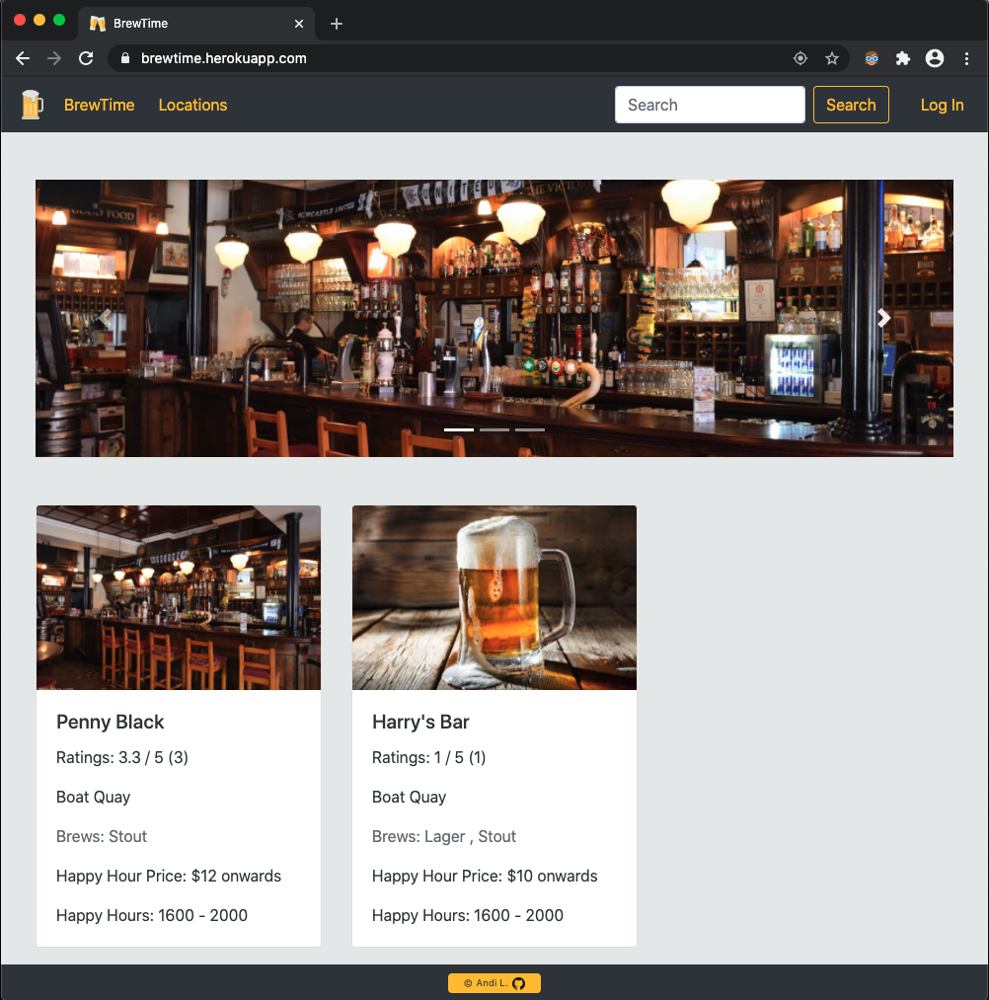
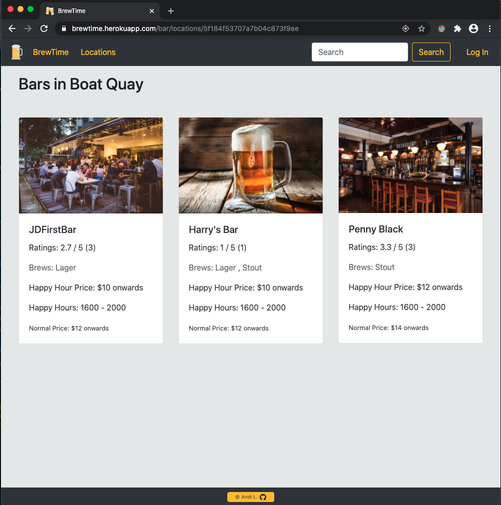
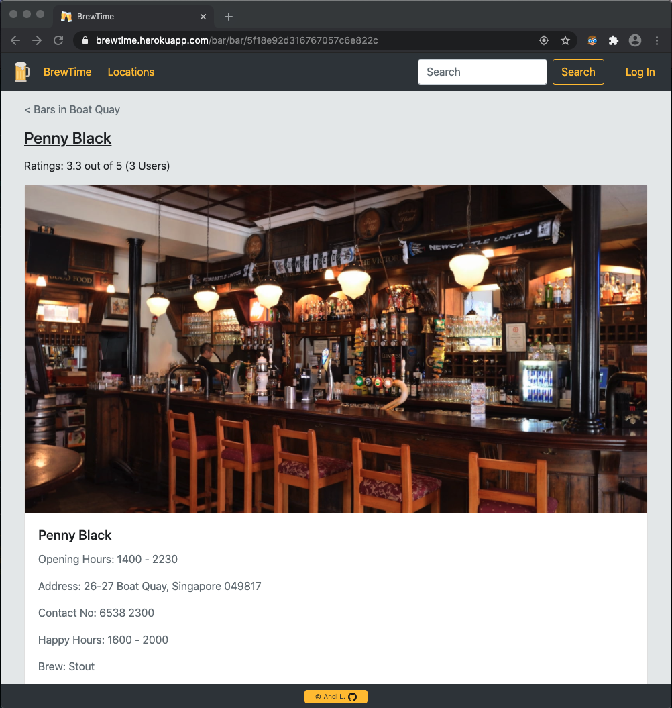

# SEI-23 Project 2

## BrewTime
Looking for the most affordable liquid gold in town? 
[BrewTime](https://brewtime.herokuapp.com/) is all you need!

### Motivation
As a bar goer who prioritizes her bar visits based on happy hour prices, I found it extremely time-consuming searching for bars in a certain location that would inform me of their happy hour prices in a single site. Often, I had to visit several blog sites, scroll through the reviews to collect these information then I can ultimately decide which bar should my friends and I visit. 

### Technologies
1. Node.js
2. Express.js
3. EJS
4. MongoDB, mongoose
5. Passport
6. Multer
7. Cloudinary
8. Heroku

### Models
1. User
2. Bar
3. Location

#### User Stories
As a [bar-owner], I'd like [add/edit my bar listing and details] so that [bar goers on the app will be aware of my bar and its happy hour promotions]
As a [bar-goer], I'd want to [know the listing of available bars based on location, happy hour price, brew types] in order to save time from looking through less relevant listings
As a [bar-goer], I'd like to [rate the bars] to [keep other bar goers informed]

### Wireframe

#### Actual

### MVP 
#### Features
- List bars in a search location
- Within each bar card, display the following details
    - Location
    - Address
    - Contact
    - HH Price
    - HH Time
    - NH Price
    - Opening Hours
    - Brew Types

- Users 
    - Admin
    - bar owners
    - regular users / patrons

- Log-in
    - admin
        - ability to create/add new locations for bar owners to select from
        - view all the bar owners (& their bars) and regular users
    - bar owners 
        - view all their bar listings
        - ability to create bar and add to specific location listing, upload bar image
        - edit bar details & ability to replace image
        - add up to 2 brew types and their prices
        - delete bar

- Without Log in
    - All
        - can view home page, all locations, all bars in a specific location, specific bar info
        

### Further
#### Features
- Logged in users
    - Allow logged in users to rate bars
    
- Admin
    - Update featured list and link up featured bars to display in homepage

- All
    - display bar information and current ratings
    - search on navbar based on bar name, location, brew types, HH price
    - do advanced search (double-filter) based on location or brew types with either HH price or Normal price

#### Bugs & Issues Faced

#### Further Possible Improvements
- Refactor code
- Dynamic addition of new rows to fill in additional brew types & their prices
- Geolocation (Bars near me), show on googlemap with bar pins (name & HH price) 
- Filter listing based on HH start time
- Ratings & Comments
    - Restrict user from rating the same bar more than once
    - Allow users to leave comments with timestamp

- Button options to sorting bars based on Normal price, happy hour price, happy hour time in a location 
- A list of top 10 bars based on ratings & no of reviews 
- A list of top 10 bars with additional filters (eg. price or time or locaton)

#### Sources
- Logo and favicon by [flaticon](https://www.flaticon.com/)

#### Grateful for
- [Guru Schnecke](https://github.com/guru-schnecke)

